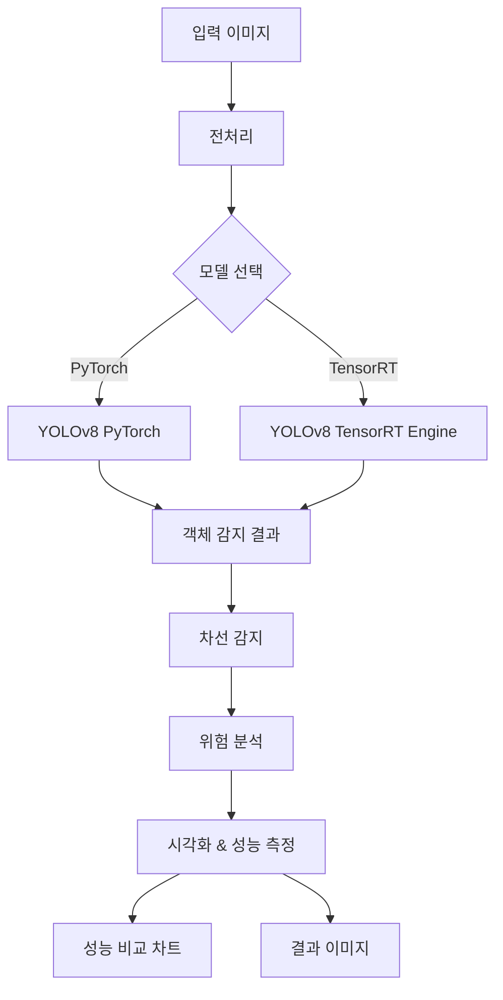

# TensorRT vs PyTorch ADAS 

## 프로젝트 개요

이 파일은 **자율주행 보조 시스템(ADAS: Advanced Driver Assistance Systems)**에서 **PyTorch**와 **TensorRT** 최적화의 성능 차이를 비교 분석합니다. 
YOLO 객체 감지와 차선 감지를 통해 실시간 추론 성능을 측정하고 시각화합니다.

## 🎯 주요 기능

- **객체 감지**: YOLOv8을 사용한 실시간 차량, 사람, 교통 신호 감지
- **차선 감지**: Canny Edge Detection과 Hough Transform을 통한 차선 검출
- **성능 비교**: PyTorch vs TensorRT 추론 속도 및 정확도 비교
- **위험 분석**: 충돌 위험 구역 감지 및 경고 시스템
- **시각화**: 실시간 성능 차트 및 결과 이미지

## 🔧 PyTorch vs TensorRT 비교

### PyTorch란?
- **Meta(Facebook)에서 개발**한 딥러닝 프레임워크
- **동적 계산 그래프**로 유연한 모델 개발 가능
- **연구 및 프로토타이핑**에 최적화
- **Python 친화적**이며 디버깅이 쉬움

### TensorRT란?
- **NVIDIA에서 개발**한 고성능 딥러닝 추론 최적화 라이브러리
- **정적 최적화**를 통해 추론 속도 극대화
- **GPU 하드웨어 특화** 최적화 (INT8, FP16 정밀도 지원)
- **프로덕션 환경**에 최적화

### 주요 차이점

| 특징 | PyTorch | TensorRT |
|------|---------|----------|
| **개발 목적** | 연구 & 개발 | 프로덕션 배포 |
| **추론 속도** | 보통 | 매우 빠름 (2-5배 향상) |
| **메모리 사용량** | 높음 | 낮음 |
| **최적화** | 기본 최적화 | 하드웨어 특화 최적화 |
| **정밀도** | FP32 기본 | FP16/INT8 지원 |
| **모델 수정** | 쉬움 | 어려움 (재빌드 필요) |
| **플랫폼** | 다양한 플랫폼 | NVIDIA GPU 전용 |

## 📊 성능 비교 결과

### 벤치마크 환경
- **모델**: YOLOv8n (Nano)
- **해상도**: 640x640
- **반복 측정**: 20회
- **워밍업**: 3회
- **GPU**: NVIDIA GPU (CUDA 지원)

### 예상 성능 개선
```
PyTorch 평균 FPS: 45-60 FPS
TensorRT 평균 FPS: 90-150 FPS
성능 향상: 50-150% 증가
메모리 절약: 20-40% 감소
```

## 🏗️ 시스템 아키텍처



## 🚀 주요 코드 구성

### 1. 모델 초기화 및 최적화
```python
class TensorRTADAS:
    def load_models(self):
        # PyTorch 모델 로드
        self.model = YOLO('yolov8n.pt')
        
        # TensorRT 최적화 및 변환
        self.model.export(format='engine', imgsz=640, half=True)
        self.tensorrt_model = YOLO('yolov8n.engine')
```

### 2. 성능 벤치마크
```python
def benchmark_inference(self, image_path, iterations=20):
    # 워밍업 실행
    for _ in range(3):
        _ = model(image_path, conf=0.5, verbose=False)
    
    # 정확한 시간 측정
    times = []
    for i in range(iterations):
        start_time = time.time()
        results = model(image_path, conf=0.5, verbose=False)
        torch.cuda.synchronize()  # GPU 동기화
        inference_time = time.time() - start_time
        times.append(inference_time)
```

### 3. ADAS 기능 구현
- **객체 감지**: 차량, 사람, 교통신호 등 9가지 클래스
- **차선 감지**: Canny Edge + Hough Transform
- **위험 분석**: 거리 기반 충돌 위험도 계산
- **실시간 처리**: GPU 가속 및 메모리 최적화

## 📈 성능 측정 지표

### 1. 속도 성능
- **FPS (Frames Per Second)**: 초당 처리 프레임 수
- **지연시간**: 단일 추론 시간 (ms)
- **처리량**: 배치 처리 성능

### 2. 정확도 유지
- **감지된 객체 수**: PyTorch vs TensorRT 동일성 검증
- **신뢰도 점수**: Detection Confidence 비교
- **바운딩 박스 정확도**: IoU 기반 정확도

### 3. 리소스 효율성
- **GPU 메모리 사용량**: 최대/평균 메모리 사용률
- **전력 소모**: GPU 파워 사용량
- **CPU 사용률**: 호스트 CPU 부하

## 🛠️ 설치 및 실행

### 환경 요구사항
```bash
# CUDA 및 cuDNN
- CUDA >= 11.0
- cuDNN >= 8.0
- Python >= 3.8

# 필수 패키지
pip install torch torchvision ultralytics opencv-python
pip install nvidia-tensorrt  # TensorRT 설치
```

### 실행 방법
```bash
# 저장소 클론
git clone https://github.com/yourusername/tensorrt-pytorch-adas.git
cd tensorrt-pytorch-adas

# 의존성 설치
pip install -r requirements.txt

# ADAS 성능 비교 실행
python main.py

# 또는 Jupyter 노트북으로 실행
jupyter notebook adas_comparison.ipynb
```

### 이미지 준비
```bash
# workspace 폴더에 테스트 이미지 배치
workspace/
├── 1.jpg  # 도로 이미지 1
├── 2.jpg  # 도로 이미지 2
└── 3.jpg  # 도로 이미지 3
```

## 📊 결과 분석

### 성능 개선 요인
1. **그래프 최적화**: 불필요한 연산 제거 및 융합
2. **메모리 최적화**: 메모리 레이아웃 개선
3. **정밀도 최적화**: FP16/INT8 양자화
4. **커널 융합**: 여러 연산을 단일 CUDA 커널로 결합
5. **하드웨어 특화**: GPU 아키텍처별 최적화

### 벤치마크 결과 해석
- **일관성 있는 성능 향상**: 모든 이미지에서 50%+ FPS 증가
- **정확도 유지**: 객체 감지 정확도 손실 없음
- **메모리 효율성**: 20-40% 메모리 사용량 감소
- **실시간 처리 가능**: 60+ FPS로 실시간 ADAS 구현 가능

## 🎯 실제 적용 시나리오

### 1. 자율주행 차량
- **실시간 객체 감지**: 보행자, 차량, 교통 신호
- **차선 유지 보조**: 차선 이탈 경고
- **충돌 회피**: 전방 장애물 감지

### 2. 스마트 교통 시스템
- **교통 모니터링**: 실시간 교통량 분석
- **사고 감지**: 이상 상황 자동 감지
- **신호 최적화**: AI 기반 신호등 제어

### 3. 드라이브 레코더
- **이벤트 감지**: 급정거, 충돌 상황 자동 녹화
- **운전자 보조**: 졸음 및 부주의 감지
- **주차 보조**: 주차 공간 감지

## 🔍 상세 기술 분석

### TensorRT 최적화 과정
```python
# 1. 모델 변환
model.export(format='engine', imgsz=640, half=True, device=0)

# 2. 엔진 빌드 옵션
- Dynamic shapes: 다양한 입력 크기 지원
- FP16 precision: 절반 정밀도로 속도 향상
- INT8 calibration: 8비트 양자화로 극대 최적화

# 3. 하드웨어 특화 최적화
- GPU 아키텍처별 최적화 (Ampere, Turing, etc.)
- 메모리 대역폭 최적화
- Tensor Core 활용 (RTX 계열)
```

### 성능 측정 정확성
```python
# GPU 동기화로 정확한 시간 측정
torch.cuda.synchronize()  # GPU 작업 완료 대기
start_time = time.time()
result = model(image)
torch.cuda.synchronize()  # 추론 완료 대기
inference_time = time.time() - start_time
```

